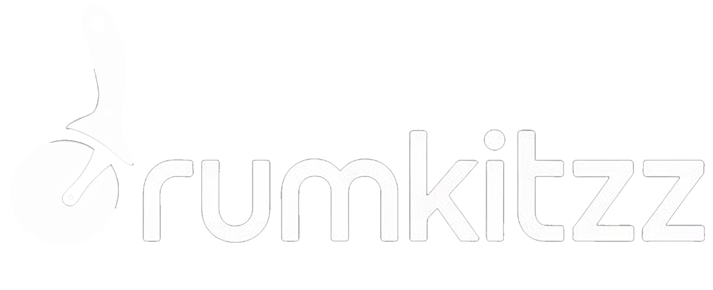

# DrumKitzz - AI-Powered Drum Kit Creation Platform

## 🎯 Visionn

DrumKitzz is a revolutionary web-based platform that transforms how producers create, process, and share drum samples. By combining AI-powered audio extraction, intelligent slice detection, and a thriving marketplace, we're building the future of drum kit creation.

## 🚀 What Makes DrumKitzz Special

- **AI Drum Extraction**: Automatically isolate drum stems from any audio using state-of-the-art source separation
- **Intelligent Slice Detection**: Advanced transient detection automatically identifies and categorizes drum hits (kicks, snares, hats, etc.)
- **Professional Audio Editor**: Waveform visualization, fade controls, and sample editing tools
- **Marketplace**: Buy, sell, and discover high-quality drum kits from producers worldwide
- **Social Features**: Follow producers, share kits, and build your reputation
- **Export Flexibility**: Export in multiple formats (WAV, MP3) with MIDI mapping and metadata

## 📋 Table of Contents

- [Quick Start](#quick-start)
- [Environment Setup](#environment-setup)
- [Features](#features)
- [Tech Stack](#tech-stack)
- [Project Structure](#project-structure)
- [Development Guide](#development-guide)
- [Deployment](#deployment)
- [API Documentation](#api-documentation)
- [Contributing](#contributing)

## 🚀 Quick Start

### Prerequisites

- Node.js 18+ 
- npm or yarn
- Supabase account (free tier available)
- Stripe account (for payments - optional for development)

### Installation

\`\`\`bash
# Clone the repository
git clone https://github.com/yourusername/drumkitzz.git
cd drumkitzz

# Install dependencies
npm install

# Copy environment variables
cp .env.example .env.local

# Set up your environment variables (see below)
# Edit .env.local with your keys

# Run database migrations
npm run db:migrate

# Start development server
npm run dev
\`\`\`

Visit `http://localhost:3000` to see the app!

## 🔐 Environment Setup

### Required Environment Variables

Create a `.env.local` file with the following variables:

#### 1. Supabase (Database & Authentication)

\`\`\`bash
# Get these from: https://supabase.com/dashboard/project/_/settings/api
NEXT_PUBLIC_SUPABASE_URL=https://your-project.supabase.co
NEXT_PUBLIC_SUPABASE_ANON_KEY=your-anon-key
SUPABASE_SERVICE_ROLE_KEY=your-service-role-key
\`\`\`

**How to get:**
1. Go to [supabase.com](https://supabase.com)
2. Create a new project (free tier available)
3. Go to Settings → API
4. Copy the URL and anon key
5. Copy the service_role key (keep this secret!)

#### 2. Upstash Redis (Rate Limiting & Caching)

\`\`\`bash
# Get these from: https://console.upstash.com
UPSTASH_REDIS_REST_URL=https://your-redis.upstash.io
UPSTASH_REDIS_REST_TOKEN=your-token
\`\`\`

**How to get:**
1. Go to [console.upstash.com](https://console.upstash.com)
2. Create a new Redis database (free tier: 10K commands/day)
3. Copy the REST URL and REST Token from the database details

**Note:** Upstash is used for rate limiting API requests and caching. If you don't set this up, rate limiting will be disabled in development.

#### 3. AI Drum Separation (Demucs via Replicate)

We've switched to **Demucs**, a free, open-source AI model for drum separation:

\`\`\`bash
# Get this from: https://replicate.com
REPLICATE_API_TOKEN=your-replicate-token
\`\`\`

**How to get:**
1. Go to [replicate.com](https://replicate.com)
2. Sign up for free account
3. Go to Account Settings → API tokens
4. Create a new token
5. **Free tier:** $0.02 per prediction (very affordable!)

**Why Demucs?**
- ✅ Open-source (MIT license)
- ✅ State-of-the-art quality
- ✅ Very affordable ($0.02 per separation)
- ✅ Fast processing (30-60 seconds)
- ✅ No vendor lock-in

**Alternative:** Local Demucs (100% Free)
If you want to run Demucs locally (no API costs):
1. Install Python 3.8+
2. Install Demucs: `pip install demucs`
3. Set `USE_LOCAL_DEMUCS=true` in `.env.local`

See [Local Demucs Setup](#local-demucs-setup) below.

#### 4. Stripe (Payments - Optional for Development)

\`\`\`bash
# Get these from: https://dashboard.stripe.com/apikeys
STRIPE_SECRET_KEY=sk_test_...
NEXT_PUBLIC_STRIPE_PUBLISHABLE_KEY=pk_test_...
STRIPE_WEBHOOK_SECRET=whsec_...
\`\`\`

**How to get:**
1. Go to [stripe.com](https://stripe.com)
2. Create account and activate test mode
3. Go to Developers → API keys
4. Copy the Secret key and Publishable key
5. For webhooks: Developers → Webhooks → Add endpoint
   - URL: `https://your-domain.com/api/webhooks/stripe`
   - Events: `checkout.session.completed`, `payment_intent.succeeded`

**Note:** You can skip Stripe setup during initial development. Marketplace features will show mock data.

#### 5. Security Webhook (Optional)

\`\`\`bash
# Custom security event webhook URL
SECURITY_WEBHOOK_URL=https://your-monitoring-service.com/webhook
\`\`\`

**What is this?**
This is an optional webhook URL where security events (failed login attempts, rate limit violations, suspicious activity) are sent. 

**Options:**
- Leave empty for development (events logged to console)
- Use a service like [webhook.site](https://webhook.site) for testing
- Use your monitoring service (Sentry, DataDog, etc.)
- Set up your own endpoint to receive security alerts

**Example webhook payload:**
\`\`\`json
{
  "event": "rate_limit_exceeded",
  "severity": "warning",
  "user_id": "user_123",
  "ip": "192.168.1.1",
  "timestamp": "2024-01-15T10:30:00Z"
}
\`\`\`

### Local Demucs Setup (100% Free Alternative)

If you want to run drum separation locally without any API costs:

1. **Install Python 3.8+**
   \`\`\`bash
   python --version  # Should be 3.8 or higher
   \`\`\`

2. **Install Demucs**
   \`\`\`bash
   pip install demucs
   \`\`\`

3. **Update .env.local**
   \`\`\`bash
   USE_LOCAL_DEMUCS=true
   DEMUCS_MODEL=htdemucs_ft  # or htdemucs for faster processing
   \`\`\`

4. **Restart your dev server**
   \`\`\`bash
   npm run dev
   \`\`\`

**Pros of Local Demucs:**
- ✅ 100% free
- ✅ No API limits
- ✅ Privacy (audio never leaves your computer)
- ✅ Fast for short clips

**Cons:**
- ❌ Requires Python setup
- ❌ Uses local GPU/CPU (slower on weak machines)
- ❌ Can't use in serverless environments (Netlify/Vercel)

For production, we recommend using Replicate API for scalability.

### Environment Variable Summary

| Variable | Required | Free Option | Purpose |
|----------|----------|-------------|---------|
| Supabase | ✅ Yes | ✅ Yes (10k rows) | Database, Auth |
| Upstash | ⚠️ Recommended | ✅ Yes (10k req/day) | Rate limiting |
| Replicate | ✅ Yes | ✅ Yes ($5 free credit) | AI drum separation |
| Stripe | ❌ Optional | ✅ Yes (test mode) | Payments |
| Security Webhook | ❌ Optional | ✅ Yes (webhook.site) | Security alerts |

**Total Cost for MVP:** $0 (all free tiers available!)

## 🎨 Features

### Core Features (MVP - Current)

#### 1. Audio Input & Processing
- **File Upload**: Drag & drop or select audio files (WAV, MP3, FLAC, OGG)
- **Recording**: Record audio directly from microphone (5-60 seconds)
- **YouTube Extraction**: Extract audio from YouTube videos
- **AI Drum Separation**: Automatically isolate drum stem using Demucs AI
- **Waveform Visualization**: Real-time audio visualization with zoom and scroll

#### 2. Intelligent Slice Detection
- **Transient Detection**: Automatically detect drum hits using energy analysis
- **Adjustable Sensitivity**: Fine-tune detection threshold and minimum distance
- **Type Classification**: AI categorization (kick, snare, hat, tom, cymbal, perc)
- **Visual Feedback**: Preview potential slices before committing

#### 3. Sample Editor
- **Individual Waveforms**: Detailed waveform for each detected slice
- **Trim Controls**: Precise start/end point adjustment with knobs
- **Fade In/Out**: Adjustable fade curves (0-500ms) with shape control
- **Playback**: Instant preview of individual slices
- **Grid Layouts**: 1-4 slices per row for different workflows

#### 4. Export & Delivery
- **Format Options**: Export as WAV or MP3
- **Folder Structure**: Organized by drum type (Kicks/, Snares/, etc.)
- **MIDI Mapping**: Optional MIDI file for quick DAW loading
- **Metadata Files**: Text files with slice information
- **Batch Processing**: Export all selected slices at once
- **Naming Convention**: Customizable kit prefix and auto-numbering

### Marketplace Features (Phase 2 - Planned)

#### User Management
- Supabase authentication (email, Google, GitHub)
- User profiles with bio, avatar, social links
- Producer stats (kits sold, followers, reviews)
- Email notifications (sales, comments, follows)

#### Browse & Discover
- Search by genre, BPM, tags, price
- Filter by newest, popular, top-rated
- Audio previews (30-second demos)
- Genre categories (Hip-Hop, Electronic, Rock, etc.)
- "Featured" and "Trending" sections

#### Selling & Pricing
- List kits for sale ($1-$100 range)
- Set custom prices or offer free downloads
- Stripe payment processing (creator gets 70%)
- Instant digital delivery after purchase
- Sales analytics and revenue tracking

#### Social Features
- Follow favorite producers
- Like/favorite kits
- Comment on kits with discussions
- Share kits on social media
- User feed of new releases from followed creators

#### Reviews & Ratings
- 5-star rating system
- Written reviews with audio quality ratings
- Verified purchase badges
- Creator responses to reviews
- Helpful vote system

### Admin Features (Phase 3 - Planned)

- Content moderation dashboard
- Copyright infringement reporting
- User management (ban, suspend)
- Analytics and reporting
- Featured kit curation
- Payout management

## 🛠 Tech Stack

### Frontend
- **Next.js 15** (App Router) - React framework with SSR
- **TypeScript** - Type safety and better DX
- **Tailwind CSS** - Utility-first styling
- **shadcn/ui** - High-quality React components
- **Lucide Icons** - Beautiful icon set
- **Web Audio API** - Real-time audio processing

### Backend
- **Next.js API Routes** - Serverless API endpoints
- **Supabase** - PostgreSQL database + Authentication
- **Upstash Redis** - Rate limiting and caching
- **Stripe** - Payment processing
- **Replicate** - AI model hosting (Demucs)

### AI & Audio Processing
- **Demucs** - State-of-the-art source separation
- **Web Audio API** - Client-side audio processing
- **FFmpeg.wasm** (planned) - Browser-based audio encoding

### DevOps & Tools
- **Netlify** - Hosting and deployment
- **GitHub Actions** - CI/CD pipeline
- **ESLint + Prettier** - Code quality
- **Sentry** (planned) - Error tracking

## 📁 Project Structure

\`\`\`
drumkitzz/
├── app/
│   ├── api/                    # API Routes
│   │   ├── extract-drums/      # Demucs AI extraction
│   │   └── youtube-extract/    # YouTube audio extraction
│   ├── components/             # React Components
│   │   ├── waveform.tsx        # Main waveform display
│   │   ├── slice-waveform.tsx  # Individual slice waveform
│   │   ├── knob.tsx            # Rotary knob control
│   │   ├── youtube-extractor.tsx
│   │   ├── extraction-progress-dialog.tsx
│   │   └── auth/               # Authentication components
│   ├── marketplace/            # Marketplace pages
│   ├── my-kits/                # User's drum kits
│   ├── social/                 # Social features
│   ├── admin/                  # Admin dashboard
│   ├── page.tsx                # Main editor page
│   ├── layout.tsx              # Root layout
│   └── globals.css             # Global styles
├── components/
│   ├── ui/                     # shadcn/ui components
│   └── navbar.tsx              # Navigation
├── lib/
│   ├── audio-extraction.ts     # Demucs integration
│   ├── rate-limit.ts           # Rate limiting logic
│   ├── secure-upload.ts        # File upload security
│   └── utils.ts                # Utility functions
├── public/
│   └── images/                 # Static images
├── docs/
│   ├── PRD.md                  # Product Requirements Doc
│   └── API.md                  # API Documentation
├── scripts/
│   └── db/                     # Database migrations
├── project-architecture.json   # Full project mapping
├── .env.example                # Environment template
├── .env.local                  # Your environment variables (gitignored)
├── next.config.mjs             # Next.js configuration
├── tailwind.config.ts          # Tailwind configuration
├── package.json                # Dependencies
└── README.md                   # This file
\`\`\`

## 👨‍💻 Development Guide

### Running Locally

\`\`\`bash
# Start development server (http://localhost:3000)
npm run dev

# Run type checking
npm run type-check

# Run linter
npm run lint

# Format code
npm run format

# Build for production
npm run build

# Start production server
npm start
\`\`\`

### Database Migrations

\`\`\`bash
# Create a new migration
npm run db:migrate:create -- migration_name

# Run pending migrations
npm run db:migrate

# Rollback last migration
npm run db:migrate:rollback
\`\`\`

### Testing Audio Processing

1. **Upload a test file**: Use the sample files in `public/test-audio/`
2. **Adjust sensitivity**: Start with 0.15, increase for fewer slices
3. **Check classifications**: Verify kicks, snares, hats are correct
4. **Export test**: Export a few slices to verify audio quality

### Common Issues

**Issue: Audio doesn't play**
- Check browser console for errors
- Ensure audio context is initialized (requires user interaction)
- Try a different audio file format

**Issue: Slice detection finds too many/few slices**
- Adjust sensitivity slider (lower = fewer slices)
- Adjust minimum distance (higher = fewer slices)
- Try isolating drum stem first with AI extraction

**Issue: AI extraction is slow**
- Replicate API typically takes 30-60 seconds
- Check your internet connection
- Consider using local Demucs for faster processing

**Issue: Environment variables not loading**
- Make sure file is named `.env.local` (not `.env`)
- Restart dev server after changing env vars
- Check for typos in variable names (case-sensitive!)

## 🚀 Deployment

### Deploy to Netlify (Recommended)

1. **Push to GitHub**
   \`\`\`bash
   git push origin main
   \`\`\`

2. **Connect to Netlify**
   - Go to [netlify.com](https://netlify.com)
   - Click "Add new site" → "Import an existing project"
   - Select your GitHub repository
   - Netlify will auto-detect Next.js

3. **Configure Build Settings**
   - Build command: `npm run build`
   - Publish directory: `.next`
   - Netlify will automatically use the Next.js runtime

4. **Add Environment Variables**
   - In Netlify dashboard, go to Site settings → Environment variables
   - Add all variables from `.env.local`
   - Make sure they're available for all deploy contexts

5. **Deploy**
   - Click "Deploy site"
   - Netlify will build and deploy your app
   - You'll get a URL like `https://drumkitzz.netlify.app`

6. **Set up Custom Domain** (Optional)
   - Go to Domain settings
   - Add your custom domain
   - Update DNS records as instructed

### Deploy Elsewhere

DrumKitzz can be deployed to any platform that supports Next.js:

- **Vercel**: Alternative hosting with auto-detection
- **AWS Amplify**: Use the Next.js SSR template
- **Railway**: One-click Next.js deployment
- **Self-hosted**: Use `npm run build && npm start`

**Note:** For AI extraction, ensure your hosting supports:
- External API calls (Replicate)
- OR Python runtime (for local Demucs)

## 📚 API Documentation

### Drum Extraction API

**Endpoint:** `POST /api/extract-drums`

Extract drum stem from audio using Demucs AI.

**Request:**
\`\`\`typescript
FormData {
  audio: File,           // Audio file to process
  action: 'upload',      // Action type
}
\`\`\`

**Response:**
\`\`\`typescript
{
  success: boolean,
  taskId: string,        // Track processing status
  status: 'processing',
  message: string
}
\`\`\`

**Check Status:**
\`\`\`typescript
FormData {
  action: 'check',
  taskId: string
}
\`\`\`

**Response:**
\`\`\`typescript
{
  success: boolean,
  status: 'complete' | 'processing' | 'error',
  audioUrl?: string,     // Download URL when complete
  error?: string
}
\`\`\`

### YouTube Extraction API

**Endpoint:** `POST /api/youtube-extract`

Extract audio from YouTube video.

**Request:**
\`\`\`typescript
{
  url: string,           // YouTube video URL
}
\`\`\`

**Response:**
\`\`\`typescript
{
  success: boolean,
  audioUrl: string,      // Blob URL of extracted audio
  title: string,         // Video title
  duration: number,      // Duration in seconds
  error?: string
}
\`\`\`

## 🤝 Contributing

We welcome contributions! Here's how to get started:

1. **Fork the repository**
2. **Create a feature branch**: `git checkout -b feature/amazing-feature`
3. **Make your changes**
4. **Add tests** (if applicable)
5. **Commit**: `git commit -m 'Add amazing feature'`
6. **Push**: `git push origin feature/amazing-feature`
7. **Open a Pull Request**

### Code Style

- Use TypeScript for type safety
- Follow existing component patterns
- Use Tailwind CSS for styling
- Add comments for complex logic
- Keep components small and focused

### Commit Messages

Follow the [Conventional Commits](https://www.conventionalcommits.org/) format:

- `feat:` New feature
- `fix:` Bug fix
- `docs:` Documentation changes
- `style:` Code style changes (formatting)
- `refactor:` Code refactoring
- `test:` Test additions or changes
- `chore:` Build process or auxiliary tool changes

## 📄 License

This project is licensed under the MIT License - see the [LICENSE](LICENSE) file for details.

## 🙏 Acknowledgments

- **Demucs** - Amazing open-source source separation by Facebook Research
- **Replicate** - Easy AI model deployment
- **shadcn/ui** - Beautiful, accessible component library
- **Supabase** - Backend as a service
- **Netlify** - Hosting and deployment

## 📞 Support

- **Documentation**: [docs.drumkitzz.com](https://docs.drumkitzz.com)
- **Discord**: [discord.gg/drumkitzz](https://discord.gg/drumkitzz)
- **Email**: support@drumkitzz.com
- **Issues**: [GitHub Issues](https://github.com/yourusername/drumkitzz/issues)

## 🗺 Roadmap

### Phase 1: MVP (Current)
- ✅ Audio upload and recording
- ✅ AI drum extraction (Demucs)
- ✅ Slice detection and classification
- ✅ Waveform editing
- ✅ Export with multiple formats
- 🔄 YouTube integration
- 🔄 Polish and bug fixes

### Phase 2: Marketplace (Q2 2024)
- User authentication and profiles
- Kit listing and search
- Stripe payment integration
- Digital delivery system
- Review and rating system

### Phase 3: Social (Q3 2024)
- Follow system
- Comments and discussions
- User feed
- Social sharing
- Notifications

### Phase 4: Advanced (Q4 2024)
- Mobile apps (iOS/Android)
- DAW plugin integration
- Advanced AI features (BPM detection, key detection)
- Collaborative editing
- Advanced marketplace features

---

**Built with ❤️ by producers, for producers**

Transform any audio into professional drum kits in seconds. Welcome to the future of sampling.
